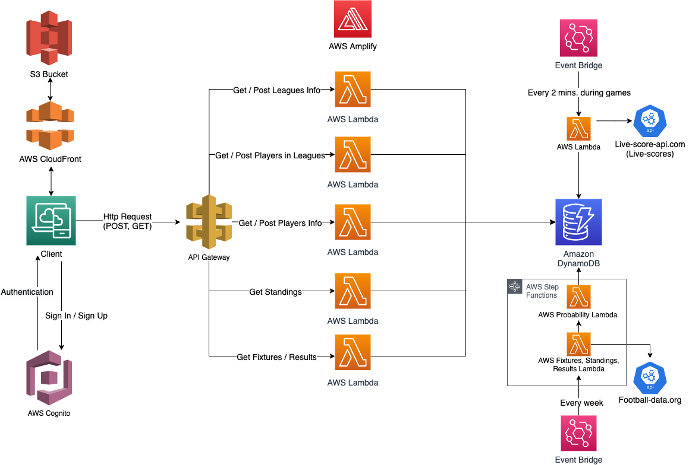
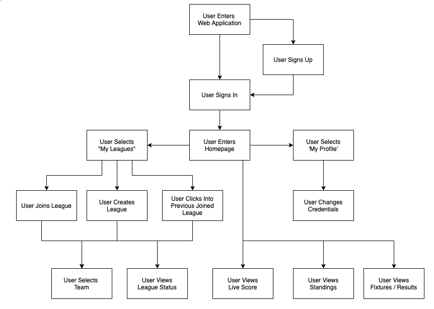
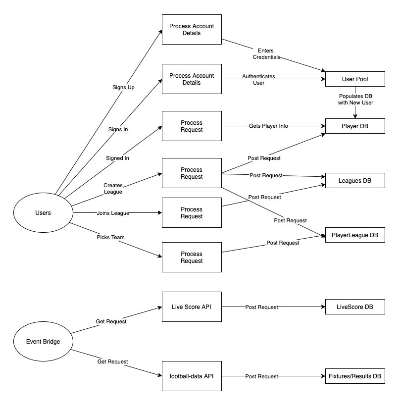

# Functional Specification
## CA400 4th Year Project
**Philip Donnelly & Tom Callaghan**

******
## Table of Contents:

 1. **Introduction**
	 * 1.1 Overview
	 * 1.2 Business Context
	 * 1.3 Glossary
2. **General Description**
	* 2.1 Product / System Functions
	* 2.2 User Characteristics and Objectives
	* 2.3 Operational Scenarios
	* 2.4 Constraints
3. **Functional Requirements**
	* 3.1 Authentication Flow
	* 3.2 Join / Create Leagues
	* 3.3 League Functionality (Team Selection / Elimination)
	* 3.4 Team Probability
	* 3.5 Live Scores
4. **System Architecture**
	* 4.1 System Architecture
5. **High-Level Design**
	* 5.1 High-Level Design Diagram
	* 5.2 Data Flow Diagram
6. **Preliminary Schedule**
	* 6.1 Project Plan
	* 6.2 Gantt Chart
7. **Appendicies**
******
# 1. Introduction

## 1.1 Overview
The overview of our project _LastManStanding_ is to create a fully automated version of the well-known competition "Last Man Standing". _LastManStanding_ is a league based game where players pick a Premier League team each week to represent them for that week. If the player’s team wins their game against the opposition, the player proceeds to next week's stage. If the player’s team of choice loses or draws against their opposition, the player is knocked out and cannot continue onto the next stage.

## 1.2 Business Context
There are several business contexts that our project could undertake. After looking at similar services we have identified three business contexts which are:

**Paywall:** _LastManStanding_ could have a business model where a user has access to joining 1 league and if they want to create or join more leagues they must pay a subscription-based fee each month to access the full service.

**Advertisements:** _LastManStanding_ could be a service where it generates money through advertisements. With soccer being a multi-billion euro enterprise companies would be able to advertise their businesses on the site, targeting a specific client in the process.

**Buy Outright:** Before creating an account for _LastManStanding_ users must pay an outright fee for the service and once paid the user can use the site as much as they want.

**Percentage Cut:** _LastManStanding_ could implement and cut off the top method. For this, a league would have a buy-in, for example, €5. Each user pays the €5 into the league and the winner of the league takes all of the money. _LastManStanding_ could take a percentage of the pot for each league for example if the league pot was €50 and _LastManStanding_ takes 10% of the pot the user will receive €45 and _LastManStanding_ takes €5.

## 1.3 glossary

**Technical:**
* AWS - Amazon Web Services

* REST API - Representational state transfer is a software architectural style that defines a set of constraints to be used for creating Web services

* Serverless - Serverless is a method of providing backend services on an as-used basis. Servers are still used, but a company that gets backend services from a serverless vendor is charged based on usage, not a fixed amount of bandwidth or number of servers.

* NoSql Database - NoSQL database provides a mechanism for storage and retrieval of data that is modelled in means other than the tabular relations used in relational databases

**Services:**

* AWS Cognito - Authentication

* AWS CloudWatch - Monitor applications

* AWS Step Functions - Trigger action in ordered steps

* AWS lambda - Action based functions that can perform code

* S3 Bucket - Blob storage

* DynamoDB - noSQL Database

* API Gateway - REST API

* AWS Event Bridges - Trigger lambda functions at certain time/event

# 2. General Description:

## 2.1 Product / System Functions
### Leagues
Within _LastManStanding_ there will be a large number of leagues. These leagues will be set up by the competition's users. Users will have the option to either create or join leagues, once they are signed in. The user who creates the league will be given a code that is specific to the given league. Once the league is set up successfully, users can join the league using the code provided by the league owner. This code will be entered into the "Join League" section, and the user will appear in the league. Users will have one week to join the league or once the first round of team selection begins the league will be locked and ready to start.

The users will be allowed to pick from all teams within the Premier League in the first week. When a player picks a team, they will not be able to pick that team for the rest of the competition. The only scenario where a player can pick the team for a second time is if they have picked all the available teams within the one competition. Users will be able to change their picked team up until the night before the first kick-off in the Premier League. At this point, the league will be locked until all Premier League matches of that week have been completed. Once all matches are completed, the users that picked a team that lost or drew their match will be knocked out of the competition. The users that picked a winning team will progress to the next game week. If all users are knocked out, the league will be reset and everyone will restart will all teams available.

### News & Updates
Users will be able to keep up to date with the Premier League. Fixtures, results and news updates will be displayed on the front page of the web application. This way the users will be able to keep track of each team's progress and form. This will help make team selections for the following weeks.

### Probability
To accommodate for users that may only be participating in the competition for charity reasons or if they have no knowledge of the Premier League, there will a probability of each team winning calculated every week. This will help them to participate in the competition by aiding in their team selection thus having a chance to win.

### Live Scores
During a game weekend when matches are underway there will be live scores visible during live games. The live score will be a basic score display of both teams and the minute in the match. Users can keep an eye on the live scores to get an idea if they'll progress to the next round. The live scores will be updated every two minutes during a match giving users a speedy update in relation to the team choice.

## 2.2 User Characteristics and Objectives
### User Demographic
Last Man Standing is a game played by many different groups of people. From charity run competitions to work communities. Therefore, the user demographic for _LastManStanding_ web application will be football fans that currently run this competition using Excel sheets or any other manual processes. Although the demographic is mostly football fans, users that get involved with no knowledge of the Premier league are also within the demographic.

### User Expectations
It is expected that the majority of the users will have some level of knowledge of the Premier League. From research, we found that there is a number of users with no knowledge of the Premier League. In order to accommodate these users, some features will be added to the web application in order to aid these sorts of users, in making educated team selections.

## 2.3 Operational Scenarios
### User Sign Up / Sign In
When a user first enters _LastManStanding_ web application they will be greeted on the home page. This will explain what _LastManStanding_ is. On the top right users will have an option to sign in or sign up.

If this is a user first time using _LastManStanding_ they will be required to sign up. Once they click the signup button a form will be displayed requiring the user to enter a new username, their email and a new password. Once submitted, the user will be required to confirm their email. This will be done by clicking a link which _LastManStanding_ has sent to their email.

If the user is a previous user of _LastManStanding_ they will simply need to sign-in. For this the user will click the sign-in button, then the sign-in option will display. A user will simply enter the username they created their account with as well as their password. Once signed in the user will be redirected to the logged-in user interface.

### League Creation / Join
To join or create a league a user must be signed in. A user will click the 'My Leagues' tab in the navigation bar. This will bring them to their league's page. On their league's page, it will display all of their current leagues.

On the top of the page, the user will have the option to join a league. This will display a simple input box in which they enter the invitation code they received from the league owner. Once submitted, the new league will be displayed in their 'My Leagues' tab.

Similar to the league join if a user wants to create a league the option to do so will be on the top of the 'My Leagues' tab. The user will click the 'create league' button. This will display an input field where they enter the name of their new league. They simply click 'create league' and the league will be displayed in their 'My leagues' section. The league creator will receive an email with the invitation code for them to distribute to who they wish. The invitation code will also be visible on the top of the league they created.

## 2.4 Constraints
### Site Speed
As the site will have a lot of different features/components, the site speed will be a constraint. The main contributor to slow site speed are images. In order to ensure the site speed is timely, all images being displayed will be compressed before uploading to the site.

### Accessibility
As the site will be used by a large number of users, it must be very accessible. In order to ensure that the site is accessible a number of tools will be used such as Lighthouse. The library we are using for design is MaterialUI, this has built-in accessibility.

### Cost
_LastManStanding_ will require many different aws services and third party API endpoints. Due to this, there will be a monthly cost for running _LastManStanding_. We plan on using serverless architecture to reduce the cost of running _LastManStanding_.

### Time
Time is a large constraint for _LastManStanding_. The web application requires a lot of different services. In order for _LastManStanding_ to be a worthwhile service for users, we need to implement a number of features which aids with the enjoyment of playing _LastManStanding_ such as the probability and live scores features.

# 3. Functional Requirements:

## 3.1 Authentication flow
### Description
The authentication flow is when a user signs in or signs up. It will user AWS Cognito to help create users and authenticate users signing in. When a user creates an account a post request will be sent to AWS Cognito with their username, email and password. These details will be saved into our user pool. When signing in, a post request will be sent to the user pool with the user's username and password. AWS Cognito will check these credentials against users in the pool and return access and an ID token to the user if successful. The user has now logged in.

### Criticality
This is a high criticality requirement. Without the authentication flow, users would not be able to sign in to _LastManStanding_ thus not being able to join or create leagues.

### Technical issues
Some technical issues with the authentication flow are getting AWS Cognito set up correctly and introducing error handling. We need to set up AWS Cognito specific to our needs which requires a lot of research and being particular with the service. After AWS Cognito is set up we need to implement correct error handling for all circumstances that a user may encounter which could cause issues.

### Dependencies with Other Requirements
There are no other dependencies on any other requirements.

## 3.2 Join / Create Leagues
### Description
The join/create leagues functionality is encountered when the user navigates to the "My leagues" tab. They will be prompted to either join or create leagues, as well as the leagues they have already joined. When creating a league the user will input the name of the league, they will then receive a league code. This code will be given to other users in order to join the league. When the user wants to join a league they have to retrieve the code from the league owner. Once they have the code they will be added into the league.

### Criticality
This is a criticality requirement. Without this requirement/functionality the users would not be able to get involved in the competition.

### Technical issues
The implementation of the admin system for league owners will be technically difficult. It will require the user to have admin access to the league they have ownership over but be a regular user for any other league.

### Dependencies with Other Requirements
This feature is highly dependant on the user authentication feature. With the user authentication, the league can not be created as users could no take ownership of these leagues without an account.

## 3.3 League Functionality (Team Selection / Elimination)
### Description
The league functionality is accessible in each league page. On the 'My leagues' page a user will click the league they want to go into and a page with league data will be displayed. On this page, users are given the option of which team they would like to choose for the upcoming round. It will display which teams they have already chosen and the teams they can choose. It will also display the other player's choices for the upcoming round. A user can also find out if they have been knocked out of the competition on this page.
The league will also need to be locked before the weekend games have commenced. This is to prevent a user from picking a team during a game whilst the team is winning or even picking a team once the game is complete.

### Criticality
There are certain elements of this component which are vital for the functionality of the game however not all features in this component are not highly critical. A users ability to choose their next round team choice is vital along with finding out if they have been eliminated. The likes of displaying other users pick for the upcoming round is not a critical feature for the game to work properly.
The locking of the league is a highly critical component of the web application. This enables the competition to work effectively.

### Technical issues
one of the big technical issues with the league functionality is in relation to locking the leagues. The first issue is in relation to the time at which to lock the league. Premier League games are subject to change. This means that we cannot lock the leagues at a certain time each Friday. On some occasions, there is a Friday night game and some weeks there is not. This means that the locking of the leagues will need to be dynamic to the week involved. We hope to create our own script with the use of AWS Cloud Watch to help with the tracking of league locking.

### Dependencies with Other Requirements
The league functionality feature is highly dependant on users being able to join and create leagues. Without this feature, users cannot use the league functionality feature

## 3.4 Team Probability
### Description
The team Probability feature is mostly for the users who are not knowledgable about football and the Premier League particularly. This feature will provide the probability of a team winning their game. It will be displayed on the league page beside each teams logo.

### Criticality
For the web app to work this feature is not a highly critical component. However, for user experience and increasing user diversity, it is a highly critical component.

### Technical Issues
The big technical issue is the fact that we hope to create our own Probability script. The issue with this is that it will need to be consistent and correct. We don't want users not trusting the probability scores they see. We can't guarantee that they will also be correct because they're probabilities based around football which is unpredictable but we hope to have similar probabilities to betting apps.

### Dependencies with Other Requirements
This feature does not have any requirements for any other feature. It works as an independent feature to the rest of the web application.

## 3.4 Live Scores
### Description
The live score feature will be predominant during a premier league weekend. For each match, there will be a live score which will be updated every two minutes. This love score feature will be visible on the logged-in home page. The live score will provide the time and minute of the match.

### Criticality
Similar to team probabilities, live scores is not a critical feature for the competition to work on _LastManStanding_. However, live scores would be a critical feature in terms of users interacting with _LastManStanding_ and adds a better user experience.

### Technical Issues
A technical issue with the live score feature is how we can get a live feed of the current live games. At first, we looked into creating a WebSocket for each live game to have a constant flow of data between _LastManStanding_ and the third party API endpoint. However, we believed this would be too costly and time-consuming to dynamically create WebSockets. Due to this, we feel an API call every two minutes ould be sufficient for the task at hand.

### Dependencies
The live score system does not have any requirements with any other functional requirement.

# 4. System Architecture:

Originally, it was decided that we would have the site running on AWS EC2 box. This meant that the application would be a client / server-based application. As this application has a chance to become very scalable as more users start using it, it was decided that we should go with a serverless architecture. The main benefits of going serverless are scalability and cost. Serverless allow applications to scale at a rapid rate without any interruptions. Also, with serverless architecture, you only pay for what you use, therefore, the costs for this application would be lowered.

The application will be monitored and managed by AWS CloudFront. AWS CloudFront uses an S3 Bucket to store the website. In order to authenticate the users on the application, AWS Cognito will be used. The user will simply sign in or sign up to Cognito, Cognito will then check the authentication token, and respond accordingly. AWS Amplify will be used to build the environment of the application. This enables developers to build and deploy secure, full-stack applications.

API Gateway will be used to deal with all HTTP requests from the frontend. This is a Rest API with endpoints. There will be a number of different AWS Lambda functions used throughout the application. Each Lambda is an API endpoint, that is triggered. The different lambdas are listed below.

- All Leagues Lambda
- Specific League Lambda
- Player Profile Lambda
- PLStandings Lambda
- Fixtures/Results Lambda

The data that is sent through the HTTP Post requests will be manipulated in the Lambda functions and then stored in DynamoDB. DynamoDb is a NoSQL database, that is scalable and easy to retrieve data from.

AWS Event Bridges will be used to trigger lambda functions to send API requests to third party APIs to retrieve information such as fixtures, standings, results and live scores.

In order to ensure that the information is retrieved from the third-party API before preforming our probability scripts, AWS Step functions will be used. This will make sure that the probability script will only ever be run after new information is received.

# 5. High-Level Design
## 5.1 High-Level Design Diagram

This is a structured walkthrough from the user perspective from when the app is downloaded and
installed. This is used to ensure the overall process of the app stays the same out the development process. It contains the main steps at each stage of the walkthrough.

## 5.2 Data Flow Diagrams

The above Data Flow Diagram is used to illustrate the data flow of each step the user may take when using the Application. It shows how data is retrieved and stored.

# 6. Preliminary Schedule
## 6.1 Project Plan
When designing our preliminary schedule we decided to split the project into four key parts. These are highlighted in the Grantt Chart below.

We have designed our project schedule in a way to optimise time working together and separately. We have also allowed time for individual goals within fourth year for both of us to meet our desired expectations. We both expect to have different challenges in the project with some tasks possibly taking longer and some tasks take a shorter time than expected. We have thought thoroughly about our expectations in regards to timings. With this in mind, each task has a definite start and end time with space for extra time if needed.

We also plan on meeting our project supervisor Dr Donal Fitzpatrick on a bi-weekly basis at the beginning and moving to weekly meetings closer o the deadline. We hope that this will give us small targets to meet and we will be able to get advice during the implementation of a feature rather than afterwards.

Below we have designed a Gantt chart of our preliminary schedule.

## 6.2 Gantt Chart

# 7. Appendices

* Amazon Web Services - https://aws.amazon.com/

* Football API (Standings, Results, Fixtures) - https://www.football-data.org/

* Live score API - http://live-score-api.com/
